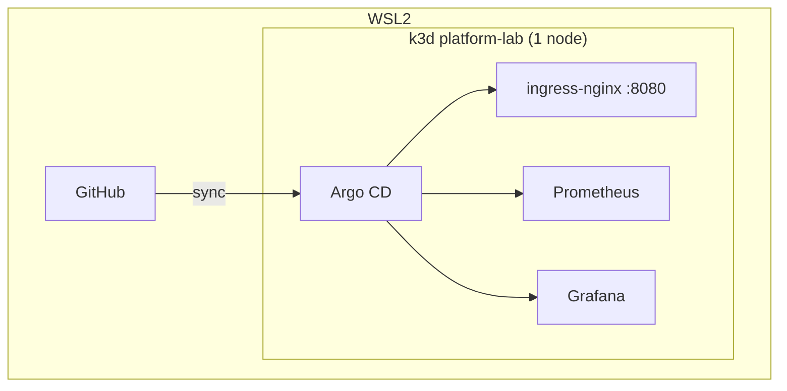

# platform-lab

Lightweight **Platform Engineering** homelab on WSL2: minimal k3d cluster, Argo CD GitOps, and resource-tuned addons for a local PC.

---

## What's included

| Component | Role |
|-----------|------|
| **k3d** | Single-node K3s on Docker (low RAM footprint) |
| **Argo CD** | GitOps — App of Apps pattern |
| **ingress-nginx** | Unified ingress on `:8080` |
| **Prometheus** | Metrics (1-day retention, 1 Gi disk) |
| **Grafana** | Dashboards wired to Prometheus |

---

## Requirements

Run everything from **WSL2** (Ubuntu):

| Tool | Version |
|------|---------|
| Docker | 20+ |
| kubectl | 1.28+ |
| Helm | 3.12+ |
| k3d | 5.6+ |

**Recommended RAM:** 6–8 Gi for WSL. The cluster uses ~2–3 Gi at idle with this profile.

```bash
docker info && kubectl version --client && helm version && k3d version
```

---

## Architecture



**Flow:** `bootstrap/create-cluster.sh` creates the cluster and installs Argo CD → applies `root-app` → Argo CD syncs infra, addons, and apps from Git.

| Application | Path |
|-------------|------|
| `platform-infra` | `gitops/infrastructure/` |
| `platform-addons` | `gitops/addons/` (`**/application.yaml` only) |
| `platform-apps` | `gitops/apps/` |

---

## Repository layout

```
platform-lab/
├── bootstrap/
│   ├── create-cluster.sh
│   ├── k3d-config.yaml
│   └── argocd-values.yaml
└── gitops/
    ├── clusters/platform-lab/   # App of Apps
    ├── infrastructure/
    ├── addons/                  # see addon conventions below
    └── apps/                    # workloads (empty)
```

### Addon conventions

Not every addon needs `templates/`. This repo uses **three patterns**:

**1. External chart** (ingress-nginx, Prometheus, Grafana)

The chart and its `templates/` live in the upstream Helm repository. Here you only store configuration:

```
gitops/addons/ingress-nginx/
├── application.yaml    # Argo CD → remote chart + local values
└── values.yaml         # overrides (resources, replicas…)
```

**2. Plain manifests** (Argo CD / Grafana Ingress)

Simple YAML resources without templating — `manifests/` folder:

```
gitops/addons/argocd-ingress/
├── application.yaml    # Argo CD → path: .../manifests
└── manifests/
    └── ingress.yaml
```

**3. Local chart** (optional, for more complex custom apps)

When you need parameterization (`{{ .Values.host }}`, conditionals, etc.), use a Helm chart in Git:

```
gitops/addons/my-addon/
├── application.yaml
├── Chart.yaml
├── values.yaml
└── templates/
    ├── deployment.yaml
    └── ingress.yaml
```

For a static Ingress, `manifests/` is enough. Move to `Chart.yaml` + `templates/` when the addon grows or you need reusable values across environments.

---

## Quick start

```bash
git clone https://github.com/Jaimegcaam/platform-lab.git
cd platform-lab
chmod +x bootstrap/create-cluster.sh
./bootstrap/create-cluster.sh
```

The script prompts for the Grafana admin password and deploys everything else via GitOps.

> **Push to GitHub before bootstrapping.** Argo CD syncs from the remote repo, not your local folder.

### Hosts file

Add to `C:\Windows\System32\drivers\etc\hosts` (Windows) and `/etc/hosts` (WSL):

```
127.0.0.1 argocd.local grafana.local
```

### Access

| Service | URL | Credentials |
|---------|-----|-------------|
| Argo CD | http://argocd.local:8080 | `admin` + initial secret |
| Grafana | http://grafana.local:8080 | `admin` + bootstrap password |
| Argo CD (alt.) | https://localhost:8081 | port-forward |

```bash
# Argo CD initial admin password
kubectl -n argocd get secret argocd-initial-admin-secret \
  -o jsonpath="{.data.password}" | base64 -d && echo

# Alternative port-forward
kubectl port-forward svc/argocd-server -n argocd 8081:443
```

### Verify

```bash
kubectl get nodes
kubectl get applications -n argocd
kubectl get pods -A
```

---

## Resource profile

Decisions to keep the homelab lightweight:

| Decision | Reason |
|----------|--------|
| Single k3d node (0 agents) | Fewer containers = less RAM |
| No Vault in bootstrap | Sensitive data via Kubernetes Secrets |
| Prometheus: 1 Gi disk, 1d retention | Enough for local demos |
| No node-exporter or Alertmanager | Optional components disabled |
| Grafana without PVC | Avoids extra disk usage |
| Argo CD without Dex / ApplicationSet | Fewer auxiliary pods |

Need more headroom? Increase `agents` in `k3d-config.yaml` and `resources` in the `values.yaml` files.

---

## Operations

```bash
k3d cluster list
kubectl config use-context k3d-platform-lab
k3d cluster delete platform-lab
```

### Add an addon

1. Create `gitops/addons/<name>/` with `application.yaml` and, if needed, `values.yaml`.
2. Commit + push → `platform-addons` discovers the new `application.yaml` automatically.

> External Helm charts use **multi-source** (remote chart + values from Git). Requires Argo CD 2.6+.

### Fork

Update `repoURL` in manifests under `gitops/clusters/`.

---

## Roadmap

- [ ] Demo app in `gitops/apps/` exposed via Ingress
- [ ] ResourceQuota / LimitRange in `infrastructure/`
- [ ] External Secrets Operator (secrets manager integration)
- [ ] CI: kubeconform + helm lint

---

## Author

**Jaime** — [github.com/Jaimegcaam/platform-lab](https://github.com/Jaimegcaam/platform-lab)
