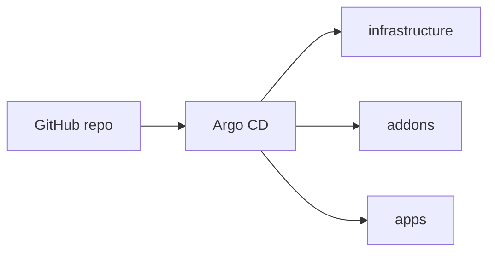

# platform-lab

A small Kubernetes homelab I run on WSL2 to practice Platform Engineering: k3d for the cluster, Argo CD for GitOps, and a few platform addons (ingress, metrics, dashboards).

It is tuned for a laptop — single node, low memory limits — not a production clone.

## What runs here

- **k3d** — one-node K3s cluster in Docker
- **Argo CD** — syncs the repo to the cluster (App of Apps)
- **ingress-nginx** — HTTP ingress on port `8080`
- **Prometheus + Grafana** — basic observability stack

## Prerequisites

WSL2 with Docker, `kubectl`, Helm, and k3d installed. Roughly 6–8 Gi RAM assigned to WSL is enough.

```bash
docker info && kubectl version --client && helm version && k3d version
```

## How it works

1. `bootstrap/create-cluster.sh` creates the k3d cluster and installs Argo CD.
2. The script asks for a Grafana password and stores it in a Kubernetes Secret (not in Git).
3. It applies `root-app`, which tells Argo CD to sync three layers from this repo:

| App | Directory | Purpose |
|-----|-----------|---------|
| `platform-infra` | `gitops/infrastructure/` | Namespaces, base resources |
| `platform-addons` | `gitops/addons/` | Platform components |
| `platform-apps` | `gitops/apps/` | Workloads (empty for now) |

`platform-addons` only picks up `**/application.yaml` files inside `gitops/addons/`, so `values.yaml` and other files in those folders are ignored by that sync.



## Repo layout

```
platform-lab/
├── bootstrap/           # cluster creation + Argo CD install
└── gitops/
    ├── clusters/platform-lab/   # App of Apps entrypoint
    ├── infrastructure/
    ├── addons/                  # one folder per addon
    └── apps/
```

Each addon folder typically has an `application.yaml`. Helm-based addons also have a `values.yaml`. Ingress resources for Argo CD and Grafana live under `manifests/` in their respective folders.

## Getting started

**Push your changes to GitHub first.** After bootstrap, Argo CD pulls from the remote repo, not your local files.

```bash
git clone https://github.com/Jaimegcaam/platform-lab.git
cd platform-lab
chmod +x bootstrap/create-cluster.sh
./bootstrap/create-cluster.sh
```

The script finds the repo root on its own, so an absolute path works too.

Add these lines to your hosts file (`/etc/hosts` in WSL and `C:\Windows\System32\drivers\etc\hosts` on Windows):

```
127.0.0.1 argocd.local grafana.local
```

Then open:

- Argo CD — http://argocd.local:8080
- Grafana — http://grafana.local:8080

Argo CD login is `admin`. Grab the initial password with:

```bash
kubectl -n argocd get secret argocd-initial-admin-secret \
  -o jsonpath="{.data.password}" | base64 -d && echo
```

Grafana login is also `admin`, using the password you typed during bootstrap.

If ingress is not ready yet, port-forward Argo CD:

```bash
kubectl port-forward svc/argocd-server -n argocd 8081:443
```

Check that things came up:

```bash
kubectl get nodes
kubectl get applications -n argocd
kubectl get pods -A
```

## Why it is kept small

- One k3d node instead of a multi-node setup
- Prometheus retention capped at 1 day, 1 Gi disk
- No Alertmanager, node-exporter, Dex, or Vault
- Resource requests kept low in the Helm values

If you have more RAM to spare, add agents in `bootstrap/k3d-config.yaml` and bump limits in the addon `values.yaml` files.

## Day-to-day commands

```bash
kubectl config use-context k3d-platform-lab
k3d cluster list
k3d cluster delete platform-lab
```

To add another addon: create a folder under `gitops/addons/`, add an `application.yaml`, commit, and push. Argo CD picks it up on the next sync.

Using a fork? Update `repoURL` in the manifests under `gitops/clusters/`.

## TODO

- [ ] Demo app in `gitops/apps/` behind ingress
- [ ] ResourceQuota / LimitRange in `infrastructure/`
- [ ] External Secrets Operator
- [ ] CI (kubeconform, helm lint)

---

Built by [Jaime](https://github.com/Jaimegcaam/platform-lab).
